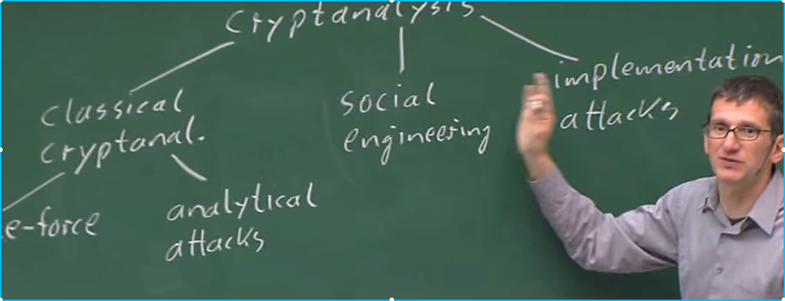

# Introduction to Cryptography

## Topics
- Classification 
- Basics / setup
- Subst-cipher
- Attack

# Classification
- Modern application of crytography
  - GNU PGP: encrypt texts
  - TruCrypt
  - SecureShell
  - (plugins) for thunderbird
  - S-MIME email enc
  - cell phone
  - hdcp-multimedia prot
  - bank cards
  - VPN
  - epassport
  - ipod
  - Kindle

### Cryptology
There are 2 branches
1. Cryptography: people trying to encrypt shits
  - Symetric algorithm
  - Asymetric algorithm
  - Protocols
2. Cryptanlysis: People trying to break shits

### What is the relationship between security and crytography
- Security is the super set of cryptography

# Setup for symetric cryptography

### Example
(simple) problem: communication over insecure channel

Alice              **communicate**                  bob
                  (Insecure channel)

What is the channel example in this picture
- Internet
- Air waves GSM, wifi
- ... etc

### Rules, and notations
- In practice, never use an untested crypt algorithm
- Notations
  -  x   == plain-text
  -  y   == cipher-text
  -  e   == encryption function
  -  d   == decryption function
  -  k   == key
  - |k| == key space(number of keys)

### What is secure channel
- A way to exchange the secret key

### Kerkhoffs's Principle[1883]
A cryptosystem should be secured even if the attacker knows all the details about the system, with the exception of the secret key

Remark: Kerkhoffs's principle is counterintuitive

# Substitution cipher

### Remarks
- historical cipher
- stupid cipher, easily broken
- Operates on letters
- All the modern cipher operates on bits, or bytes
- Idea: Replace every plain text letter a fixed cipher text letter

Example:
- A replaced by l
- B replaced by d
- G replaced by w
...

Example: e(ABBA) --> lddl

### How do we attack these cipher
#### Bruceforce
1. First look at the keyspace
2. Do a brute force attack or exhaust key search
Example: 
- key 1: 26 possibilities
- key 2: 25 possibilities
- key 26: 1 possibilities
Total we have 26! ~~ 2^88
==> impossible to brute force

#### Letter frequency
- Works because identical plaintexts map to identical cipher text symbols

# Classification of Attacks

